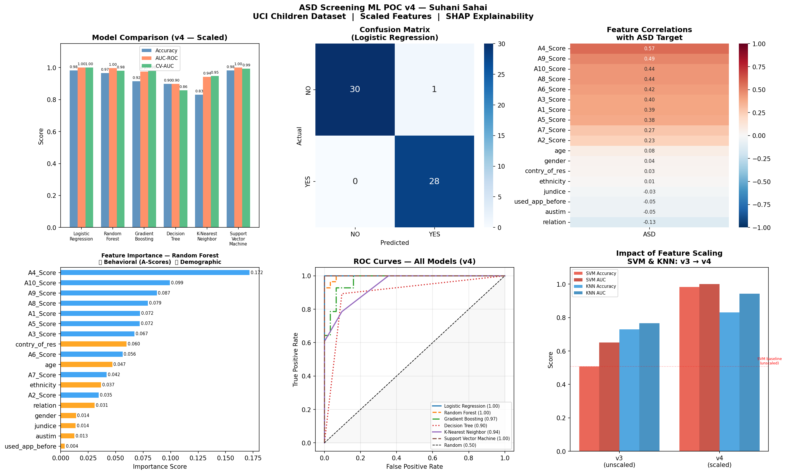
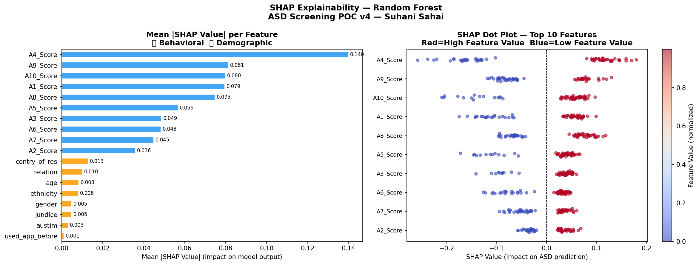

# Autism Screening Explainability
### Interpretable Machine Learning for Pediatric ASD Screening

[](https://python.org)
[](LICENSE)
[](https://archive.ics.uci.edu/dataset/419/)

---

## About

This project builds an interpretable ML pipeline for predicting autism spectrum disorder (ASD) likelihood in children using behavioral screening data. The goal is not just high accuracy — but **explainability**: understanding *why* a model flags a child as at-risk, and mapping that back to real behavioral indicators used in clinical practice.

This project is open source and intended for educational use, research exploration, and as a reference implementation for clinical ML transparency.

---

## Highlights

- **6 models compared** — Logistic Regression, SVM, Random Forest, Gradient Boosting, KNN, Decision Tree
- **SHAP explainability** — see exactly which behaviors drive each prediction
- **Feature scaling analysis** — demonstrates how `StandardScaler` transforms SVM from 50.8% → 98.3% accuracy
- **Leakage detection** — correlation analysis verifies model integrity before training
- **StratifiedKFold CV** — robust evaluation on a small, balanced dataset
- **Clean, reproducible pipeline** — single script, no notebooks required

---

## Results

| Model | Accuracy | AUC-ROC | CV-AUC |
|-------|----------|---------|--------|
| **Logistic Regression** | **0.983** | **1.000** | **1.000** |
| Support Vector Machine | 0.983 | 1.000 | 0.994 |
| Random Forest | 0.966 | 0.997 | 0.981 |
| Gradient Boosting | 0.915 | 0.975 | 0.981 |
| Decision Tree | 0.898 | 0.898 | 0.859 |
| K-Nearest Neighbor | 0.831 | 0.943 | 0.948 |

---

## Dataset

**Source**: [UCI ML Repository — Autism Spectrum Disorder Screening Data for Children](https://archive.ics.uci.edu/dataset/419/)  
**File**: `Autism-Child-Data.arff`  
**Size**: 292 children × 21 features  
**Target**: ASD diagnosis (YES / NO) — balanced classes (151 NO, 141 YES)

The dataset contains 10 behavioral screening questions (A1–A10) derived from the Q-CHAT screening tool, along with demographic features such as age, gender, ethnicity, and family history.

| Feature | Screening Question |
|---------|-------------------|
| A1 | Does your child look at you when you call his/her name? |
| A2 | How easy is it to get eye contact with your child? |
| A3 | Does your child point to indicate that s/he wants something? |
| A4 | Does your child point to share interest with you? |
| A5 | Does your child pretend? (e.g. care for dolls, toy phone) |
| A6 | Does your child follow where you're looking? |
| A7 | If visibly upset, does your child show signs of comfort? |
| A8 | Would you describe your child's first words as typical? |
| A9 | Does your child use simple gestures? |
| A10 | Does your child stare at nothing with no apparent purpose? |

---

## Pipeline

```
Raw Data (.arff)
     ↓
Leakage Detection (drop 'result', 'age_desc')
     ↓
Correlation Analysis (flag high-correlation features)
     ↓
Label Encoding + Missing Value Imputation
     ↓
StandardScaler (fit on train, transform test)
     ↓
Train/Test Split (80/20, stratified)
     ↓
6 Model Training + StratifiedKFold CV
     ↓
SHAP Explainability (Random Forest)
     ↓
Visualizations + Clinical Insights
```

---

## Quickstart

### 1. Clone the repo
```bash
git clone https://github.com/ssahai03/autism-screening-explainability.git
cd autism-screening-explainability
```

### 2. Install dependencies
```bash
pip install pandas numpy scikit-learn matplotlib seaborn shap scipy
```

### 3. Download the dataset
Download `Autism-Child-Data.arff` from the [UCI ML Repository](https://archive.ics.uci.edu/dataset/419/) and place it in the project root folder.

### 4. Run
```bash
python poc_v4.py
```

Output charts will be saved to the `outputs/` folder automatically.

---

### Model Performance


### SHAP Explainability
---

## Key Takeaways

### Feature Scaling is Non-Negotiable for SVM
Without `StandardScaler`, SVM performs at near-random (50.8% accuracy). After scaling, it reaches 98.3%. This is a commonly overlooked preprocessing step in clinical ML pipelines.

### Explainability > Accuracy Alone
A model that says "this child is at risk" is only useful if clinicians understand why. SHAP values make the model's reasoning transparent — which features pushed the prediction, by how much, and in which direction.

### Behavioral Features Outperform Demographics
The A-score behavioral questions (A1–A10) consistently outrank age, gender, ethnicity, and other demographic features in importance. Communication and social responsiveness indicators are the strongest predictors.

---


## Contributing

Contributions are welcome. If you'd like to extend this project — additional datasets, model architectures, a web interface, or clinical validation — feel free to open an issue or submit a pull request.

---

## Disclaimer

This project is for **educational and research purposes only**. It is not intended for clinical diagnosis or medical decision-making. Always consult a qualified clinician for ASD screening and diagnosis.

---

## License

MIT License — free to use, modify, and distribute with attribution.

---

## Acknowledgements

- Dataset: [Thabtah, F. (2017). UCI ML Repository](https://archive.ics.uci.edu/dataset/419/)
- SHAP library: [Lundberg & Lee, 2017](https://github.com/shap/shap)
